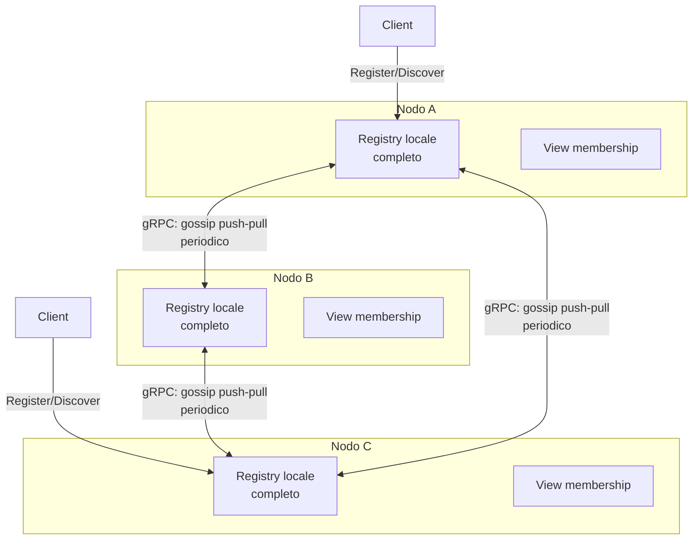

# Architettura — Progetto B1: Service Registry Distribuito

> Ogni scelta in questo documento è motivata con un riferimento diretto alle slide del corso (vedi [TEORIA_RIPASSO.md](TEORIA_RIPASSO.md)). Dove le slide non bastano (failure detection), si riusano solo i meccanismi già citati a lezione (timeout/heartbeat di Chord, gossip-based failure detection di Dynamo/Cassandra), senza importare algoritmi esterni.

---

## 1. Requisiti che guidano il design (da progettoB1_SDCC2025-26.pdf)
- Nessun server centrale, nessun single point of failure
- Tolleranza ai guasti: consistenza (eventuale) anche con crash/irraggiungibilità temporanea di nodi
- Gestione dinamica di aggiunta/rimozione servizi a runtime
- Nessun valore hard-coded (tutto configurabile)
- Go, Docker Compose, deploy su EC2

## 2. Modello di sistema (assunzioni)
- **DS asincrono**: nessun limite temporale su esecuzione dei processi, consegna dei messaggi o drift dei clock — *DS_Synchronization.pdf, slide 4*. Conseguenza: non si può ordinare gli eventi con il tempo fisico → serve un meccanismo logico di versioning (sezione 5).
- **Modello di guasto: fail-stop** — un nodo si ferma e basta, senza comportamento arbitrario — *DS_Consistency.pdf, slide 1*. Semplifica la failure detection: non serve gestire nodi "bizantini".
- **8 fallacie del distributed computing** (rete non affidabile, latenza non zero, topologia che cambia) — *DS_Introduction.pdf, slide 28-29* — giustificano perché il design assume che i messaggi di gossip possano perdersi/arrivare in ritardo e che i nodi possano entrare/uscire in qualsiasi momento (churn).

## 3. Scelta architetturale: overlay P2P non strutturato, piena replica
- **Alternative considerate** (*DS_Architecture.pdf*, sezione overlay):
  - **Overlay strutturato / DHT** (Chord, Kademlia): lookup O(log N), ma richiede mantenere una struttura (finger table / k-bucket) e gestire join/leave con costo O(log²N) — complessità non necessaria alla scala di un progetto universitario (decine di nodi, non centinaia di migliaia).
  - **Overlay non strutturato**: nodi connessi con regole semplici, alta resilienza, facilità di manutenzione — a costo di lookup meno efficiente, *ma* nel nostro caso il lookup non serve: ogni nodo mantiene una copia completa del registro (vedi sotto), quindi il "lookup" è sempre locale, O(1).
- **Scelta**: **overlay non strutturato + piena replica dello stato del registry su ogni nodo**, sincronizzata via **gossip** (anti-entropy) — esattamente il caso d'uso originario del gossip: *"proposti da Demers et al. per la consistenza dei dati in database replicati con centinaia di server"* — *DS_Communication-MOM.pdf, slide 41*.
- **Bootstrap**: un nuovo nodo scopre gli altri tramite una **seed list statica** passata da configurazione (uno dei tre meccanismi di bootstrap citati — *DS_Architecture.pdf, slide 20*).

## 4. Membership
Ogni nodo mantiene una **vista locale** (`view`) dei peer conosciuti, con stato:
- `ALIVE` — heartbeat/gossip ricevuto entro il timeout
- `SUSPECTED` — nessun contatto entro il timeout, in attesa di conferma
- `DEAD` — nessun contatto entro un secondo timeout più lungo → rimosso dalla vista attiva

Questo è coerente con il modello **fail-stop**: un nodo `DEAD` non torna in vita con lo stesso stato; se rientra, è un nuovo join (ri-bootstrap). La lista di membership è essa stessa un dato che si propaga per gossip (**group membership** è uno dei domini applicativi del gossip citati esplicitamente — *DS_Communication-MOM.pdf, slide 47*).

## 5. Formato dei dati e versioning
Ogni voce del registro:

```
ServiceEntry {
  ServiceID   string
  Endpoint    string
  Version     {Counter: int, OwnerNodeID: string}   // vedi sotto
  Status      ACTIVE | REMOVED
}
```

- **Versioning**: coppia `(Counter, OwnerNodeID)` incrementata dal nodo che possiede/aggiorna l'entry — costruzione analoga al **clock scalare di Lamport** (*DS_Synchronization.pdf, slide 18-20*): contatore monotono locale, incrementato a ogni update; il `OwnerNodeID` è il **tie-breaker** per l'ordinamento totale, esattamente come nel confronto `{num[j], j} < {num[i], i}` visto sia nella Lamport's bakery (*DS_MutualExclusion+Election.pdf, slide 6*) sia nel clock scalare con ordinamento totale (*DS_Synchronization.pdf, slide 20*).
- **Riconciliazione dei conflitti**: **last-write-wins** sulla coppia `(Counter, OwnerNodeID)` — una delle due strategie di riconciliazione esplicitamente citate — *DS_Consistency.pdf, slide 17*.
- **Perché non vector clock**: le slide indicano il vector clock come soluzione per il caso DynamoDB, dove *più nodi diversi* possono scrivere concorrentemente sulla stessa chiave (*DS_Synchronization.pdf*, sezione "Timestamps in practice"). Nel nostro registry, invece, ogni service entry ha un solo "proprietario" naturale (il nodo/servizio che si registra) → i conflitti concorrenti sulla stessa entry sono l'eccezione, non la norma, quindi last-write-wins con contatore stile Lamport è sufficiente e più semplice da implementare con membership dinamica (un vector clock dovrebbe invece avere una dimensione = numero di nodi, che cambia continuamente per il churn). Questa motivazione va riportata nella relazione.

## 6. Protocollo di gossip (dissemination)
Segue il **framework generale di Kermarrec & van Steen** (*DS_Communication-MOM.pdf, slide 45-46*), applicato a ogni round:

1. **selectPeer**: il nodo sceglie i peer `ALIVE`/`SUSPECTED` dalla propria `view` con la strategia **least-recently-contacted** (peer con contatto meno recente per primi), una delle alternative esplicitamente citate dalle slide oltre alla selezione uniforme casuale — *"selecting the peer that has been least contacted (e.g., used by CockroachDB)"* (*DS_Communication-MOM.pdf, slide 45*). Preferita alla selezione casuale perché garantisce che nessun peer resti trascurato a lungo per pura sfortuna nel campionamento, riducendo il rischio di falsi `SUSPECTED`/`DEAD`
2. **selectToSend**: prepara il proprio stato locale (registro + membership) da inviare
3. **scambio push-pull**: invia il proprio stato e riceve quello del peer, in una singola interazione — strategia **push-pull**, la più rapida per convergenza: **O(ln N)** round, **O(N ln ln N)** messaggi per diffondere un aggiornamento a N nodi (*DS_Communication-MOM.pdf, slide 43-44*)
4. **selectToKeep**: per ogni entry ricevuta, confronta la versione con quella locale e mantiene quella con `(Counter, OwnerNodeID)` maggiore (last-write-wins, sezione 5)
5. **processData**: applica gli aggiornamenti allo stato locale

L'intervallo tra un round e il successivo (**gossip round/cycle**) è un parametro di configurazione (nessun hard-coding, come richiesto).

**Estensione: propagazione anche della membership, non solo dei servizi.** Oltre ai `ServiceEntry`, ogni `ExchangeRequest`/`ExchangeResponse` include anche `peer_claims`: lo `Snapshot()` completo della vista di membership locale (`PeerInfo`), con lo **stesso schema di versioning** dei servizi — `(Counter, OwnerNodeID)`, clock scalare di Lamport con tie-break sull'`OwnerNodeID` (sezione 5). Ogni volta che questo nodo produce una nuova osservazione su un peer — un contatto diretto riuscito (`RecordContact`) **o** una propria conclusione di `Sweep` (transizione a `SUSPECTED`/`DEAD`) — genera una nuova dichiarazione, incrementando il contatore più alto già conosciuto per quel peer e attribuendola a sé stesso. Chi riceve una dichiarazione tramite gossip la confronta con la propria (`Merge`, identico a `Registry.Merge`) e adotta quella più recente. Se la dichiarazione adottata è `ALIVE`, resetta anche `LastContactAt` all'orologio **locale** di chi riceve (mai un timestamp importato da un'altra macchina — il `PeerClaim` sul filo non porta nessun timestamp, solo `Counter`/`OwnerNodeID`/`State`, evitando ogni dipendenza da orologi di sistema sincronizzati tra nodi).

A differenza di una prima versione più semplice (che propagava solo le conferme positive, senza versioning), questo meccanismo propaga **anche** le conclusioni pessimistiche (`SUSPECTED`/`DEAD`) di un nodo agli altri, facendo convergere l'intero cluster verso la stessa vista di membership più rapidamente — non solo le buone notizie, come nella prima versione. Non introduce comunque nessuna garanzia più forte di quella già presente: un nodo davvero crashato smette di generare nuove dichiarazioni, quindi il timeout locale di ciascun nodo riprende comunque ad avanzare non appena le conferme cessano, indipendentemente da eventuali dichiarazioni obsolete ancora in circolazione.

**Perché gossip e non query flooding**: il flooding ha costo di lookup O(N) e rischio di inondare la rete di messaggi ridondanti (*DS_Architecture.pdf, slide 24-27*); il gossip, pur non garantendo copertura totale al 100%, è più leggero e comunque **coerente con l'eventual consistency** richiesta dal progetto (*DS_Communication-MOM.pdf, slide 46-47*) — non serve garanzia assoluta di copertura, serve convergenza eventuale.

### Trasporto: gRPC per il gossip nodo↔nodo
La comunicazione **tra nodi** (lo scambio push-pull di `Exchange`) usa **gRPC** — *vero* RPC nel senso definito a lezione (stub client/server generati da un file `.proto`, marshalling automatico via Protocol Buffers, chiamata sincrona che restituisce direttamente il risultato) — *"RPC in Go", pacchetto 5.4* e *"gRPC", pacchetto 5.6*. Motivazioni:
- Tutti i nodi sono processi Go omogenei: il vincolo di gRPC/Protobuf (formato binario, non leggibile da linguaggi/tool generici) non è un problema qui, a differenza dell'API client-facing (sezione 8)
- gRPC fornisce nativamente deadline/cancellazione (`context.WithTimeout`) sulla singola chiamata — lo stesso ruolo che nella prima implementazione aveva il timeout dell'`http.Client`, ma integrato nel protocollo
- Precedente diretto: **etcd** (registry distribuito citato esplicitamente nella slide gRPC come progetto che lo adotta) usa gRPC per la comunicazione interna del cluster
- **Alternativa scartata**: `net/rpc` (RPC nativo di Go, pacchetto 5.4) — anch'esso valido, ma usa `gob` come formato di serializzazione, che *richiede client e server scritti in Go* (slide, sez. "Marshalling e Unmarshalling") — gRPC è stato preferito per maturità dell'ecosistema (HTTP/2, streaming, deadline) a parità di vincolo linguistico

Il file `proto/gossip.proto` definisce il servizio `Gossip` con un solo metodo RPC (`Exchange`, chiamata unaria — sezione "Tipi di Metodi RPC Supportati" della slide gRPC); il codice client/server (`internal/gossippb/`) è generato con `protoc` e **non va modificato a mano**.

**Perché non gRPC anche per l'API client-facing**: qui serve restare interoperabili con client qualsiasi (`curl`, script, futuri microservizi non-Go) e facilmente testabili senza strumenti dedicati (`grpcurl`) — per questo l'API resta HTTP+JSON (sezione 8). Coesistono quindi due protocolli nello stesso nodo, ciascuno scelto per il contesto in cui è usato, su porte separate (`grpc_port` per il gossip, `listen_port` per l'API).

## 7. Failure detection
Le slide non trattano un algoritmo dedicato: si riusano solo i due riferimenti disponibili — *(vedi TEORIA_RIPASSO.md, sezione 5)*
- Chord: *"nodes must detect failed nodes using timeouts or heartbeat mechanisms"* (*DS_Architecture.pdf, slide 37-38*)
- Dynamo/Cassandra: *"uses gossiping for node failure detection / group membership and node failure detection"* (*DS_Communication-MOM.pdf, slide 42*)

**Design adottato**:
- Ogni round di gossip funge anche da **heartbeat implicito**: se il nodo P riceve una risposta dal peer Q durante lo scambio push-pull, aggiorna il timestamp di "ultimo contatto" con Q.
- Se un nodo non ha contatti diretti o indiretti (tramite gossip su Q da parte di altri nodi) con un peer entro `TIMEOUT_SUSPECT`, lo marca `SUSPECTED` nella propria vista locale.
- Se il timeout si estende a `TIMEOUT_DEAD` (> `TIMEOUT_SUSPECT`), il nodo lo marca `DEAD` (solo nella propria `membership.View` — non più contattato dal gossip) e lo logga.
- `TIMEOUT_SUSPECT`, `TIMEOUT_DEAD` e l'intervallo di gossip sono tutti parametri configurabili.

**Scelta importante: il crash di un nodo NON rimuove le service entry che aveva scritto.**
Una prima versione del design marcava come `REMOVED` (tombstone) tutte le entry il cui `OwnerNodeID` corrispondeva al nodo appena dichiarato `DEAD`. Questa scelta è stata **rivista**: il crash di un nodo del registry **non implica** che il servizio applicativo registrato tramite lui sia a sua volta morto — `OwnerNodeID` indica solo quale nodo ha gestito l'ultima scrittura di quella entry, non dove gira il servizio reale (sezione 8). Inoltre, grazie alla **piena replica** (sezione 3), il crash di un nodo non causa **alcuna perdita di dati**: le sue entry sono già al sicuro su tutti gli altri nodi prima ancora che muoia — rimuoverle sarebbe una scelta di policy, non una necessità tecnica imposta dal crash.

Il design finale separa quindi nettamente due responsabilità:
- **Failure detection** (`membership.go`): sapere quali nodi sono vivi, per non contattarli più via gossip — resta necessario e attivo
- **Sopravvivenza dei dati** (`registry.go`): garantita **esclusivamente dalla replica**, indipendente dallo stato di vita del nodo che ha scritto per ultimo una entry

Questo dimostra in modo più diretto la proprietà richiesta dalla consegna ("nessun single point of failure"): un servizio registrato tramite un nodo che poi crasha resta **scopribile tramite qualsiasi altro nodo superstite**, senza alcuna finestra di indisponibilità dovuta a una rimozione attiva.

## 8. API client-facing
Un client può contattare **qualsiasi nodo** (nessun entry point fisso, coerente con "nessun server centrale"):
- `Register(ServiceID, Endpoint)` → il nodo contattato crea/aggiorna l'entry localmente con nuova versione `(Counter+1, proprio NodeID)`, poi la propaga al prossimo round di gossip
- `Deregister(ServiceID)` → analogo, marca l'entry `REMOVED`
- `Discover(ServiceID)` / `List()` → lettura locale della vista corrente del registro (nessuna comunicazione di rete necessaria, dato che ogni nodo ha una copia replicata) → risposta immediata, ma potenzialmente non aggiornatissima (finestra di inconsistenza, sezione 9)

## 9. Modello di consistenza risultante: sistema AP
- Il progetto richiede "nessun SPOF" e tolleranza a crash/irraggiungibilità → per il **CAP theorem** (*DS_Consistency.pdf, slide 18-20*) non si può avere anche Consistency forte: il registry è per design un sistema **AP** (Availability + Partition tolerance), con **eventual consistency** come modello risultante (*DS_Consistency.pdf, slide 16-17*) — le letture possono restituire dati leggermente stale durante la **inconsistency window**, ma in assenza di nuovi aggiornamenti tutte le repliche convergono.
- Questo è il modello **BASE**, non ACID (*DS_Consistency.pdf, slide 22-23*) — terminologia da usare nella relazione.

## 10. Configurabilità (nessun hard-coding)
Parametri da esternalizzare (file di config / env vars):
- Porta dell'API client-facing (`listen_port`) e porta del servizio gRPC di gossip (`grpc_port`), separate
- Seed list per il bootstrap
- Intervallo del round di gossip
- `TIMEOUT_SUSPECT`, `TIMEOUT_DEAD`
- Numero di peer selezionati per round (se si vuole andare oltre 1 peer/round)

## 11. Diagramma architetturale



## 12. Mappatura concetto → fonte (riepilogo)
| Scelta di design | Concetto delle slide | Fonte |
|---|---|---|
| Overlay non strutturato + piena replica | Overlay non strutturati vs strutturati | DS_Architecture.pdf |
| Bootstrap via seed list | Compiti del nodo P2P: bootstrap | DS_Architecture.pdf, slide 20 |
| Gossip anti-entropy push-pull | Framework Kermarrec & van Steen | DS_Communication-MOM.pdf, slide 43-46 |
| Trasporto gossip nodo↔nodo su gRPC | RPC (stub, marshalling automatico), gRPC/Protobuf | appunti 5.4 "RPC in Go", appunti 5.6 "gRPC" |
| API client-facing su HTTP+JSON (non gRPC) | Interoperabilità multi-linguaggio, formato leggibile | appunti 5.4 "RPC in Go" (limiti di gob), appunti 5.6 "gRPC" (formato non umano-leggibile) |
| Versioning (Counter, OwnerNodeID) | Clock scalare di Lamport + tie-break su ID | DS_Synchronization.pdf, slide 18-20 |
| Riconciliazione last-write-wins | Strategie di riconciliazione | DS_Consistency.pdf, slide 17 |
| Failure detection heartbeat/timeout | Chord ring stabilization; gossip di Dynamo/Cassandra | DS_Architecture.pdf slide 37-38; DS_Communication-MOM.pdf slide 42 |
| Modello finale AP / eventual consistency | CAP theorem | DS_Consistency.pdf, slide 18-20 |

---
**Prossimo passo**: passare alla Fase 2/3 della [ROADMAP](ROADMAP.md) — setup ambiente e implementazione del core del nodo (struttura dati, API, loop di gossip).
